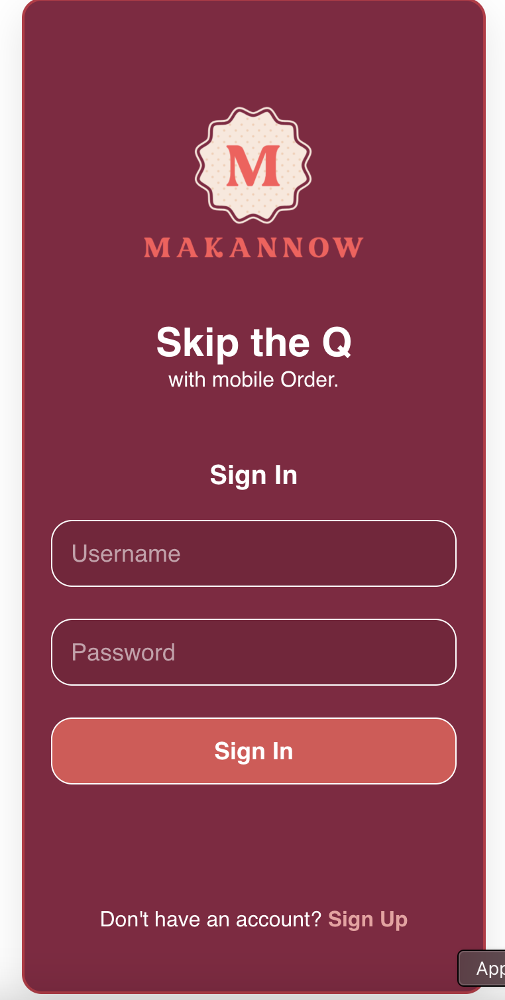
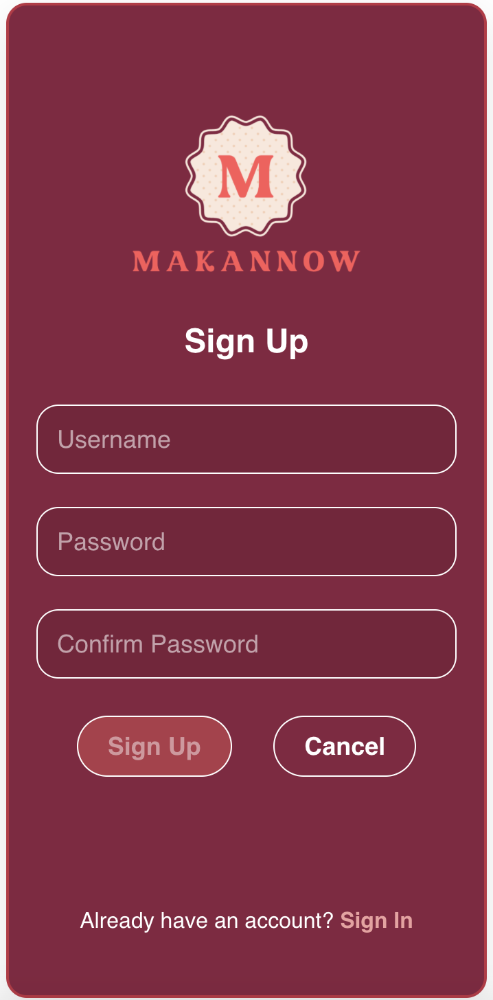
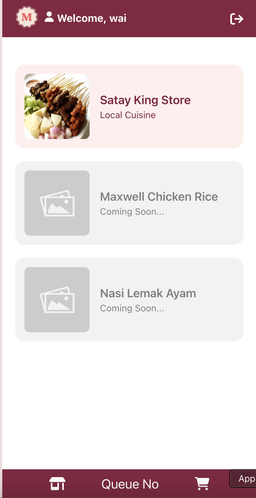
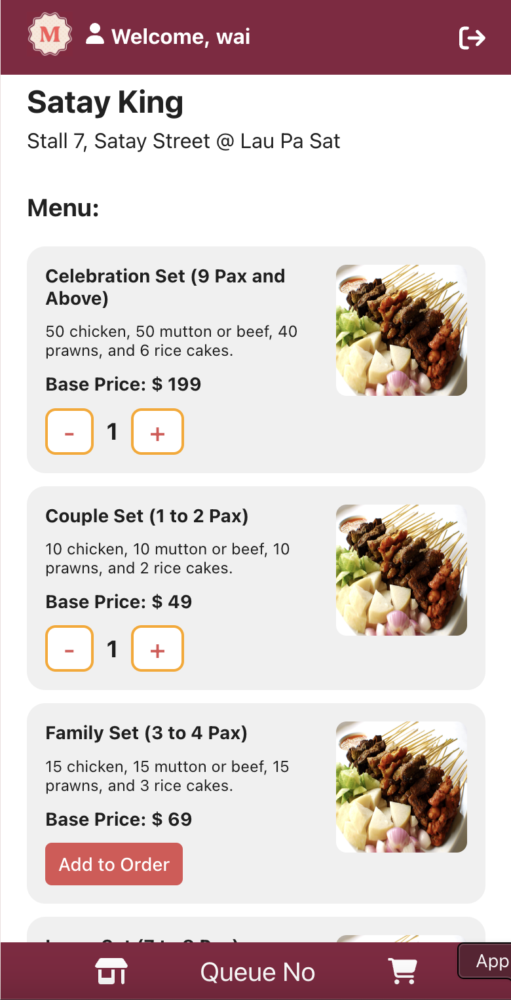
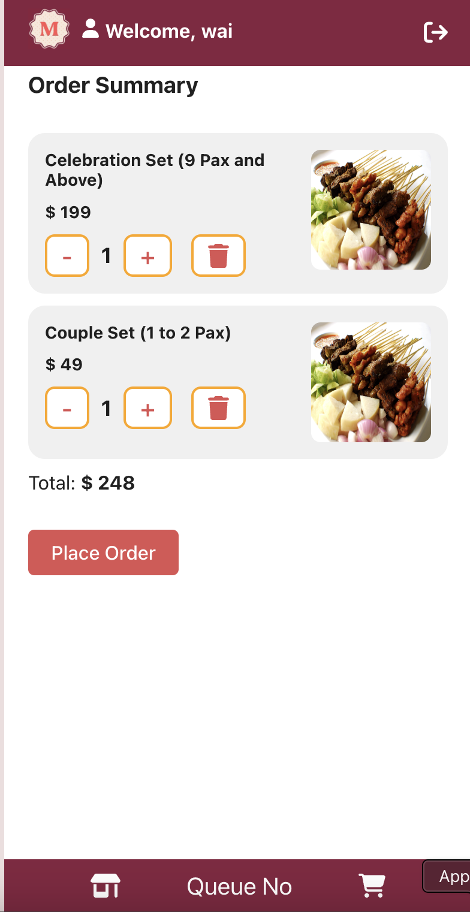
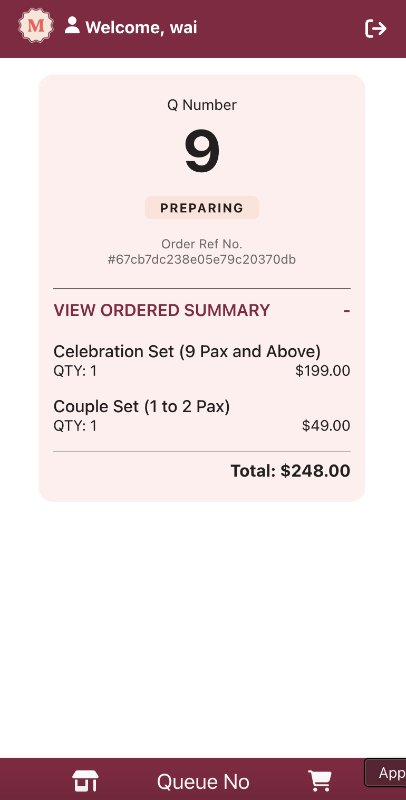

# Makan Now (Online Queue Application)

## Live link
https://makan-now.vercel.app/

## Backend Repo
https://github.com/parthi-n/makan-now-backend

## Description

This project is designed for hawkers
provide users with a seamless experience for browsing, selecting, and purchasing meals though the application. 

Create a responsive and user-friendly online queue system that allows customers to place orders, track their position in the queue, receive real-time updates, and complete their checkout efficiently.

## Wireframe

## User Stories

- As a customer, I want to sign up if I don't have an account.

- As a customer, I want to sign in if I have already registered.

- As a customer, I want to choose shops 

- As a customer, I want to browse the available food items, so I can choose the dishes I want to order.

- As a customer, I want to add selected food items to my cart, so I can review my order before checking out.

- As a customer, I want to review my cart and modify the quantities or remove items before proceeding to checkout.

- As a customer, I want to proceed to checkout after reviewing my cart, so I can complete my order.

- As a customer, I want to receive a queue number after checkout, so I can wait for my order to be prepared and served.

# Screenshots 

## Sign In page

## Sign Up page

## Shops page

## Menu and Add page

## Place order (order summary) page

## Queue Number page

## Workflow Process

  **Sign Up for an Account**
  - The customer navigates to the sign-up page.
The customer enters required information such as username, password and comfirm password.
  - The customer submits the form to create an account.
 - The system confirms account creation and may direct the customer to the directly sign them in.

 **Sign In to an Existing Account**
 - The customer navigates to the sign-in page.
 - The customer enters their registered username and password.
  - The customer submits the sign-in form.
  - The system verifies the credentials and grants access to the customer's account.

  **Browse Food Items**
  - The customer accesses a page displaying available food items.

  **Add Items to Cart**
  - Customers select food items and add them to their cart 
  - The cart is dynamically updated with each addition, showing items, quantities, and total price.

  **Checkout**
    - Once the customer is ready to checkout, they review the items in the cart.
    - After confirming the items, they click "Checkout."

  **Queue Number Generation**
    - After checkout, the system generates a unique queue number for the customer.
      The queue number is returned by the backend and displayed to the customer on the screen.

## Technologies Used (frontend)
  - HTML
  - CSS
  - JAVASCRIPT
  - REACT

## Deployment
  - Vercel

## Future plans
 
**QR Code Ordering System**
  - Implement a QR code scanning feature for customers to easily place orders.
  - Customers can scan a QR code displayed at the hawker stall or shop to directly access the menu and place an order.

**Admin Dashboard for Store Owners**

  - Create an admin page for store owners to manage their business.
  - Store owners can add/edit/remove menu items, set store hours, update prices, and track orders.
  - Admins will also have access to real-time data on orders, sales, and customer feedback.

