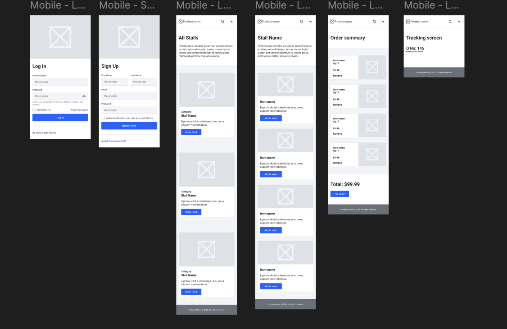

# Makan Now

## Live link
https://makan-now.vercel.app/

## Backend Repo
https://github.com/parthi-n/makan-now-backend

## Wireframe

## Description

This project is designed for hawkers
provide users with a seamless experience for browsing, selecting, and purchasing meals though the application. 

Create a responsive and user-friendly online queue system that allows customers to place orders, track their position in the queue, receive real-time updates, and complete their checkout efficiently.

## User Stories

- As a customer, I want to browse the available food items, so I can choose the dishes I want to order.

- As a customer, I want to add selected food items to my cart, so I can review my order before checking out.

- As a customer, I want to review my cart and modify the quantities or remove items before proceeding to checkout.

- As a customer, I want to proceed to checkout after reviewing my cart, so I can complete my order.

- As a customer, I want to receive a queue number after checkout, so I can wait for my order to be prepared and served.

## Workflow Process
  ### Browse Food Items
    - The customer accesses a page displaying available food items.

  ### Add Items to Cart:
    - Customers select food items and add them to their cart 
    - The cart is dynamically updated with each addition, showing items, quantities, and total price.

  ### Checkout
    - Once the customer is ready to checkout, they review the items in the cart.
    - After confirming the items, they click "Checkout."

  ### Queue Number Generation
    - After checkout, the system generates a unique queue number for the customer.
      The queue number is returned by the backend and displayed to the customer on the screen.

